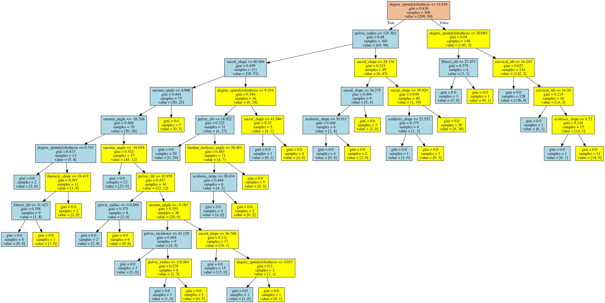

# HealthCare-Predictions

Processes a collection of physical spine data (which consists of numeric data).
Uses Decision Tree Classifier to predict (give assumption) if a spine is normal or abnormal. 

The system is separated on several parts - classifier, front-end part which
gets the user data, visualizes the result and shows an image of the decision tree
which the classifier has build. 
The server part is developed on Python using the Flask framework. It has the following 
functionality - connects the client part and the classifier by sending the data between them.
The classifier is developed on Python using the scikit-learn library.

Additonal information about the system:
- Client-side validation

Technology Stack:
- Front-end
  o	HTML
  o	CSS
  o	JavaScript
  o	jQuery
- Back-end
  o	Python
  o	Flask framework
    	Request – reads request data from the client-side
    	Json – work with json objects
  o	Flask_cors – work with CORS requests
-	Classifier
  o	scikit-learn
    	tree - for the classifier
  o	numpy – work with arrays
  o	pandas – read .csv files
  o	collections – work with list in Python
  o	Graphviz – to generate the tree in .dot file
  o	pydotplus – to visualize the .dot file with the tree
  
  
  Generated image of the tree:
  
